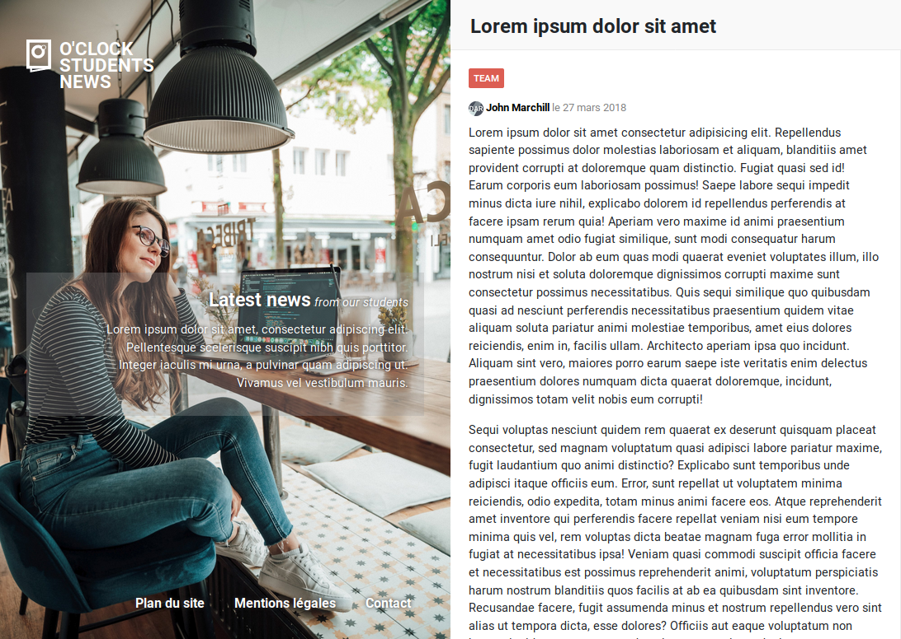

# oNews - Multipage

O'Clock n'a pas encore sorti son journal d'étudiants :scream:

Bah oui, on n'affichait jamais le contenu complet de chaque article !!

Votre mission, si vous l'acceptez (... pfff évidemment qu'on l'accepte), sera de créer de nouvelles pages pour chaque article :muscle:



## Préambule

- l'intégration a déjà été effectuée
- une intégration de _correction_ est fournie avec cet atelier, mais vous pouvez utiliser votre intégration de oNews à la place si vous le souhaitez
- pour être interprété, le code PHP doit être écrit dans un fichier `.php`
- [fiche récap mélange PHP & HTML](https://kourou.oclock.io/ressources/fiche-recap/la-syntaxe-php/#un-peu-de-html-avec-%c3%a7a)

## Étape 1 - Premier article

### Objectif

Rediriger l'internaute sur la page du premier article avec son texte complet

### Comment faire ?

- créer un fichier `html/article.html` qui contiendra le code pour cette nouvelle page Web
- le texte sera un _lorem_ de 400 caractères (emmet : `lorem400`)
- mettre en place le lien de _Continue reading_ du premier article vers cette page HTML créée
- faire l'intégration HTML/CSS de cette page `html/article.html` selon le screenshot fourni plus haut
- un lien "Back to home" n'apparait pas sur le screenshot mais est présent après le texte de l'article. Il reprend le même style que le lien _Continue reading_

## Étape 2 - Factoriser

### Problème

Le code HTML est majoritairement dupliqué entre ces 2 fichiers HTML

### Objectif

Factoriser ce code HTML, c'est-à-dire éviter les répétitions

### Comment faire ?

- HTML = statique
- PHP = dynamique
- copier ces fichiers HTML dans le répertoire `php` puis renommer
- analyser le code HTML pour savoir quels contenus factoriser
- créer des fichiers PHP si besoin, dans le répertoire `inc`

<details><summary>Indices</summary>

- il faut bien penser à renommer les fichiers en `.php`
- `include` ou `require` pour inclure des fichiers en PHP
- les fichiers inclus devront se trouver dans un sous-répertoire (bonne pratique) comme `inc`, `templates`, `views`, etc.

</details>

## Étape 3 - Données dynamiques

### Objectif

Rendre les données de la page "article" dynamiques

### Comment faire ?

- créer un tableau associatif contenant les données suivantes sur le premier article :
    - titre
    - auteur
    - texte
- au sein du code HTML de la page, afficher les données du tableau pour remplacer ces mêmes données, actuellement écrites "en dur" (statique)
- en bonus, stocker aussi les données suivantes dans le tableau associatif :
    - catégorie
    - date de publication
    - l'image de l'auteur

<details><summary>Indices</summary>

- attention, il y a deux dates, une date visible dans le rendu du navigateur et une date en HTML, utile lorsqu'un logiciel analyse la page, pensez à stocker les deux
- [fiche récap tableau associatif](https://kourou.oclock.io/ressources/fiche-recap/la-syntaxe-php/#tableaux-associatifs)
- [fiche récap mélange PHP & HTML](https://kourou.oclock.io/ressources/fiche-recap/la-syntaxe-php/#un-peu-de-html-avec-%c3%a7a)
- on peut stocker en clé le nom de la donnée (comme le nom d'une variable)
- et en valeur, la valeur de cette donnée
- l'utilisation du tableau permet de regrouper toutes ces informations en une seule variable


<details><summary>Spoiler</summary>

**PHP**

```php
$data = [
    'title' => 'Lorem ipsum dolor sit amet',
    'author' => 'John Marchill',
    'text' => 'Lorem ipsum dolor sit amet consectetur adipisicing elit. Repellendus sapiente possimus dolor molestias laboriosam et aliquam, blanditiis amet provident corrupti at doloremque quam distinctio. Fugiat quasi sed id! Earum corporis eum laboriosam possimus!',
]
```

**HTML**

```php
<h2 class="right__title"><?php echo $data['title'] ?></h2>
```

</details>

</details>

## Étape 4 - Navigation

### Objectif

Rendre le menu de gauche dynamique

### Comment faire ?

- créer les 3 pages suivantes, à partir de leur version HTML (voir dossier `html`)
  - `plan_de_site.php`
  - `mentions_legales.php`
  - `contact.php`
- :warning: on ne veut toujours pas dupliquer notre code HTML, donc on utilisera les templates existantes
- créer un tableau associatif contenant le nom et le lien de chaque élément du menu de gauche (plan du site, etc.)
- parcourir ce tableau afin de générer le code HTML de cette navigation

<details><summary>Indices</summary>

- [fiche récap tableau associatif](https://kourou.oclock.io/ressources/fiche-recap/la-syntaxe-php/#tableaux-associatifs)
- on peut stocker le label de chaque lien en clé
- et l'URL en valeur
- le moyen le plus simple pour parcourir un tableau est un `foreach` [fiche récap](https://kourou.oclock.io/ressources/fiche-recap/les-boucles/#foreach)

</details>

## Étape 5 - Toutes les pages _articles_

### Objectif

Créer une page pour chaque article

### Comment faire ?

- créer un fichier PHP par page supplémentaire (dans le dossier `php`)
- mettre en place les liens _Continue reading_ des articles vers la page (fichier PHP) correspondante

<details><summary>Pour information</summary>

- à la fin d'un script PHP, toutes les données sont détruites
- les variables de la page précédente sont perdues
- on ne peut pas transférer des données d'une page à l'autre
- à chaque page PHP appelée (via navigateur), on recommence de 0 #poissonrouge

</details>

<details><summary>Indices</summary>

- créer les fichiers :
    - `php/article2.php`
    - `php/article3.php`
    - `php/article4.php`
    - `php/article5.php`
    - `php/article6.php`
- dans chaque fichier :
    - créer le tableau associatif contenant les données à afficher pour l'article en question
    - le code HTML de la page article est répété :scream:
        - créer un fichier de `template` pour les articles
        - utiliser (inclusion) ce fichier de `template` dans les pages `article*.php`

</details>

## Étape 6 - Formulaires

### Objectif

Comprendre comment demander des données/informations à l'internaute

### Comment faire ?

- lire la documentation sur les formulaires HTML :tada:
- https://developer.mozilla.org/fr/docs/Web/Guide/HTML/Formulaires/Mon_premier_formulaire_HTML

## Bonus - page de contact

Les 5 étapes sont terminées :astonished: bravo :+1:

On peut passer au bonus alors :
- créer une page de contact
- écrire un formulaire HTML

Tous les détails se trouvent dans [le fichier du bonus](bonus.md) :wink:
