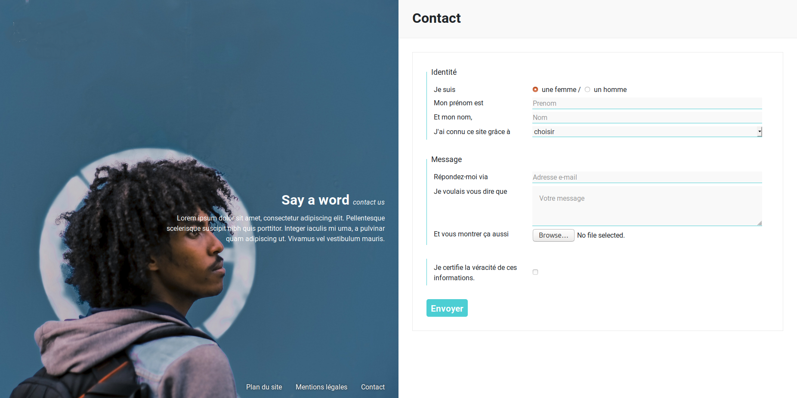

# oNews Contact

Ajoutons donc une nouvelle page à oNews... et pourquoi pas une petite page de contact ?!

## Info

Pour "J'ai connu ce site grâce à ?", voici les réponses possibles :
- Facebook
- Twitter
- Google
- Bouche à oreilles
- JT de 13h de Jean-Pierre Pernault
- Autre

## Charte

### Visuels

Le dossier `images` contient un nouveau visuel `gabriel.jpg`

### Couleurs

- bordure du formulaire : #eaeaea
- bordure de champ / bouton : #4cced3
- fond de champ : #f9f9f9

## Whaaat ?!

Pas de panique ! Pour découvrir les balises à utiliser, allons voir le **MDN** :
https://developer.mozilla.org/fr/docs/Web/Guide/HTML/Formulaires/Mon_premier_formulaire_HTML

Plus précisément, on va utiliser ces balises-là :
* https://developer.mozilla.org/fr/docs/Web/HTML/Element/form
* https://developer.mozilla.org/fr/docs/Web/HTML/Element/fieldset
* https://developer.mozilla.org/fr/docs/Web/HTML/Element/legend
* https://developer.mozilla.org/fr/docs/Web/HTML/Element/label
* https://developer.mozilla.org/fr/docs/Web/HTML/Element/input
* https://developer.mozilla.org/fr/docs/Web/HTML/Element/textarea
* https://developer.mozilla.org/fr/docs/Web/HTML/Element/button

## :warning: Précisions importantes

Certains éléments de formulaire peuvent dépendre du système d'exploitation pour leur rendu visuel comme les boutons radio ou le bouton de chargement d'un fichier par exemple. Le rendu sera donc différent selon que l'utilisateur soit sous Linux, Windows, MacOS ou un autre...

Le but ici est donc de s'approcher du design proposé dans l'image mais pas forcément d'obtenir une copie parfaite.

Et si ce sujet vous empêche de dormir :dizzy_face: voici un peu de lecture supplémentaire :arrow_down: :  
https://developer.mozilla.org/fr/docs/Web/Guide/HTML/Formulaires/Apparence_des_formulaires_HTML
